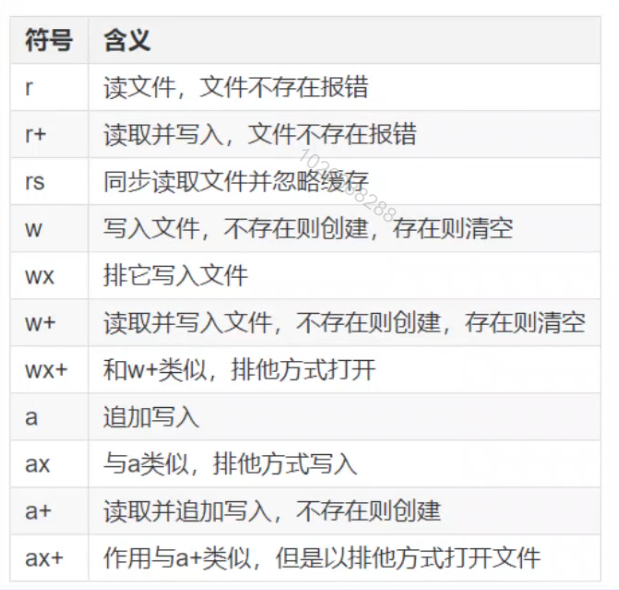

## FS文件模块

在NodeJS中，使用fs模块来实现所有有关文件及目录的创建，写入及删除操作

在fs模块中，所有的方法都分为同步和异步两种实现。

具有sync后缀的方法为同步方法，不具有sync后缀的方法为异步方法。

### 读取文件

```javascript
// 1.引入文件系统模块
let fs = require('fs');
```

###### 同步读取

```javascript
// 2.同步读取
let fd =  fs.readFileSync(__dirname+'/source/a.txt');
console.log(fd);
// <Buffer e9 ab 98 e5 a4 84 e4 b8 8d e8 83 9c e5 af 92>
console.log(fd.toString());
// 高处不胜寒
```

###### 异步读取

```javascript
// 3.异步读取
// 异步方法都是通过一个回调函数来告诉后续处理结果
fs.readFile(__dirname+'/source/a.txt',(err,data)=>{
    if(!err){
        console.log(data);
        //<Buffer e9 ab 98 e5 a4 84 e4 b8 8d e8 83 9c e5 af 92>
        console.log(data.toString());
        //高处不胜寒
    }
});
```

### 写入文件

```javascript
// 标准流程:先打开文件再写入
// 1.打开文件
let fd = fs.openSync(__dirname+'/source/b.txt','w');

// 2.同步写入内容
fs.writeFileSync(fd,'什么更痛,努力的痛还是悔恨的痛？');

// 3.保存并退出
fs.closeSync(fd);
```




### 追加写入

```javascript
let fs = require('fs');

fs.open(__dirname+'/source/c.txt','a',(err,fd)=>{
    if(!err){
        // 2.写入文件
        fs.writeFile(fd,'三人行，必有我师焉！'+Date.now()+'\n',(err)=>{
            if(!err){
                console.log('写入成功');
            }else{
                throw err;
            }
        })

        // 无论成功还是失败,都要关闭文件
        fs.close(fd,(err)=>{
            if(!err){
                console.log("文件已经保存并关闭");
            }
        })
    }
})
// 后续操作
console.log('后续操作,该操作不会被阻塞');

```
