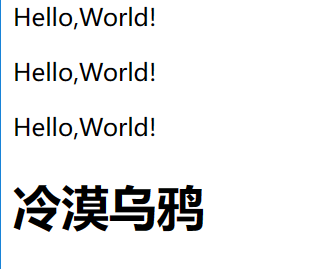

### 发送服务器响应流

```javascript
const http = require('http');
http.createServer((req,res)=>{
    console.log(res.headersSent?'响应头已经发送':'响应头未发送'); // false
    res.writeHead(200,'ok');
    console.log(res.headersSent?'响应头已经发送':'响应头未发送'); // true
}).listen(3000,'127.0.0.1',()=>{
    console.log('服务器已经启动');
});
```

res.end()用于结束响应

```javascript
// res.end()用于结束响应
res.end();
```

也可以在end()结束响应中返回一些文本,甚至是HTML.

```javascript
res.end('<h1>冷漠乌鸦</h1>');
```

客户端页面渲染可能会中文乱码,所以我们要在响应头里设置编码.

```javascript
// 在end()结束响应前设置响应头
res.setHeader('Content-Type','text/html;charset=utf-8');
```

客户端和服务器端的编码统一后,就能正常的显示结果.


在end()结束响应之前,可以多次写入数据.

```javascript
res.write('<p>Hello,World!</p>');  
res.write('<p>Hello,World!</p>');
res.write('<p>Hello,World!</p>');
```


