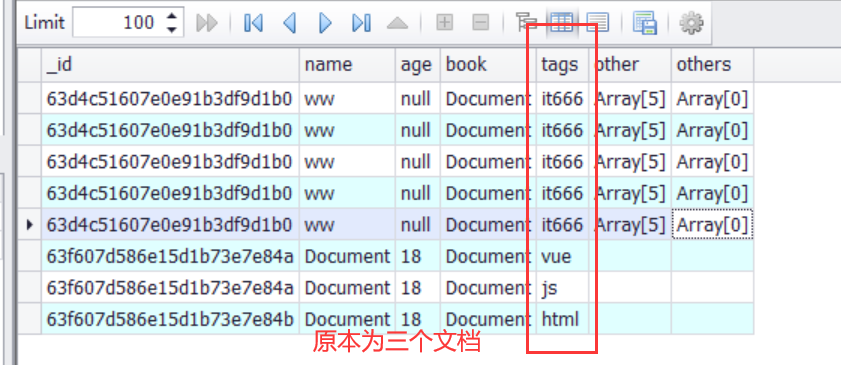
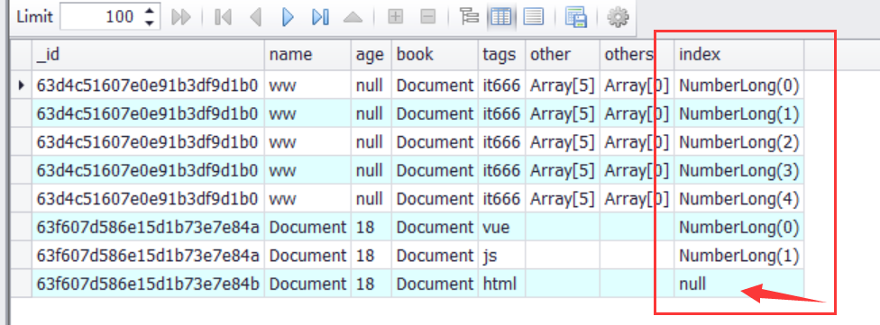

### 聚合管道阶段$unwind

$unwind:展开数组字段

格式:{$unwind:{path:`<field>`}}

```javascript
db.person.aggregate([
    {$unwind:{path:'$tags'}}
])
// 复制含有tags数组属性的文档，并将tags数组里的元素均分到复制的文档上
```



```javascript
db.person.aggregate([
    {$unwind:{
        path:'$tags',
        includeArrayIndex:'index'
    }}
])
// 为文档新增元素下标数据，如果原本字段不是数组元素，则新增为null
```



注意点：默认情况下，如果要展开的字段不是数组，也是可以展开的，但是如果文档字段是空数组或者是null，则会无视该文档。

可以使用preserveNullAndEmptyArrays属性来改变这一默认情况。

```javascript
db.person.aggregate([
    {$unwind:{
        path:'$tags',
        includeArrayIndex:'index',
        preserveNullAndEmptyArrays:true
    }}
])
// 哪怕没有目标字段也会进行展开
```
