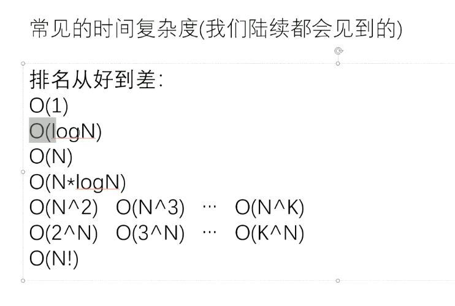

### 数据结构与算法

算法和数据结构可以认为是绝对代码能力和耐心努力的一种证明

算法和数据结构可以作为一个人的聪明程度

小技巧多如牛毛，大套路就那么几个

### 通俗理解

算法就是一种流程，而数据结构就是基于这个流程的东西。

## 时间复杂度

#### 常数时间操作

不以样本量为转移，每次都是固定时间，哪怕你传一千亿份数据，它的执行速度也是和几份数据的速度是一样的。

###### 常见的常数时间操作

算数运算 + - * /

数组寻址

赋值，比较

位运算

#### 如何确定算法流程的总操作数与样本数量之间的表达式关系

1，想象该算法流程所处理的数据状况，要按照最差情况下。

2，把整个流程彻底拆分为一个个基本动作，保证每个动作都是常数时间的操作。

3，如果数据量为N，看看基本动作的数量和N是什么关系。

##### 如何确定算法流程的时间复杂度

当完成了表达式的建立，只要把最高阶项留下即可。低阶项都去掉，高阶项的系数也去掉。

记作：O（忽略掉系数的高阶项）

为什么去掉系数?因为当样本数量大到一定程度后，系数的影响比起高阶项的影响可以忽略不计。这就是时间复杂度的意义，它是衡量算法流程的复杂程度的一种指标，该指标只与数据量有关，与过程之外的优化无关。

### 算法的注意点

1. 算法的过程，和具体的编程语言是没有什么关系的
2. 只有对算法流程非常熟悉，才能分析出这个算法流程的时间复杂度
3. 一定要确保在拆分算法流程是，拆分出来的所有行为都是常数时间操作。这意味着你写算法时，对自己的用过的每一个系统API都非常的熟悉。否则会影响你对时间复杂度的估算。

### 评估算法优劣的核心指标

时间复杂度	流程决定

额外空间复杂度	流程决定

常数项时间	实现细节决定

一般情况下，认为解决一个问题的算法流程，在时间复杂度的指标上，一定要尽可能的低，先满足了时间复杂度最低这个指标后，使用最少的空间的算法流程，叫这个问题的最优解。

一般说起最优解都是忽略掉常数项这个因素的，因为这个因素只决定了实现层次的优化和考虑，而和怎么解决整个问题的思想无关。

### 额外空间复杂度

你要实现一个算法流程，在实现算法流程的过程中，你需要开辟一些空间来支持你的算法流程。

作为输入参数的空间，不算额外空间，作为输出结果的空间，也不算额外空间。

因为这些都是必要的，和现实目标有关的。所以都不算。

但除此之外，你的流程如归乐还需要开辟空间才能让你的流程继续下去。这部分空间就是额外空间。如果你的流程只需要开辟有限几个变量，额外空间复杂度就是O(1)。

### 对数器

对数器的出现用于解决算法测试和报错排查。

1. 你想要测的方法A
2. 实现复杂度不好但是容易实现的方法B
3. 实现一个随机样本产生器
4. 把方法A和B跑相同随机样本，查看结果是否一样
5. 如果有一个随机样本使得对比结果不一致，打印样本进行人工干预，改对方法A和方法B
6. 当样本数量很多时对比测试依然正确，可以确定方法A已经正确。

### 二分算法

常见的二分是在一个有序的数组上面，展开二分搜索，但其实只要能正确构建左右两侧淘汰的逻辑，你就可以二分。

###### 局部最小值问题

### 异或运算

异或运算满足交换律和结合律
