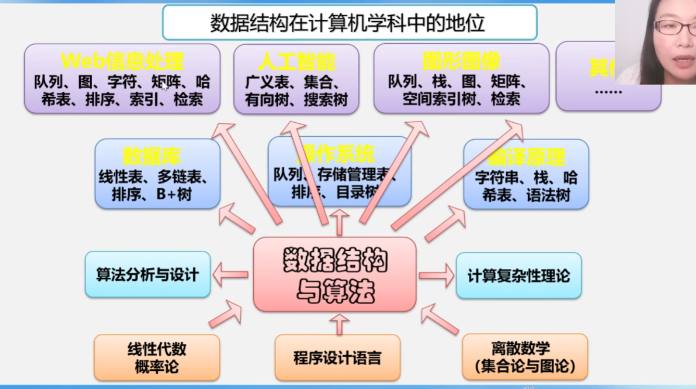
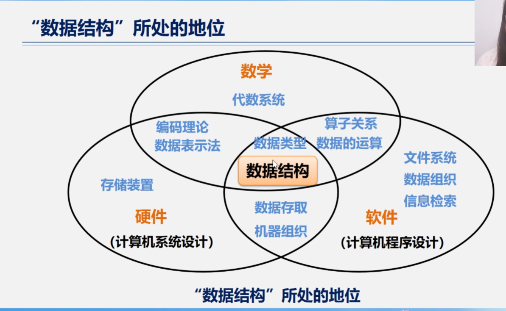

### Nicklaus Wirth

Nicklaus Wirth是Pascal语言之父，他说过的最著名的公式"程序=数据结构+算法"。一个公式展示出了程序的本质。

数据结构在计算机学科中的定位，是起到承上启下的核心地位。

### 数据结构的研究内容

1.将具体问题抽象为数学模型

    在第一步里，抽象为数学模型的本质是:

    1.先分析问题，

    2.然后提取操作对象

    3.找出操作对象之间的关系，

    4.最后用数学语言描述，这就是数据结构

2.设计算法

3.编程，调试，运行

非线性关系，就是由一个状态可以衍生出多个状态。像树一样支生。

处理问题时，首先是将问题抽象成逻辑关系和数据内容。
