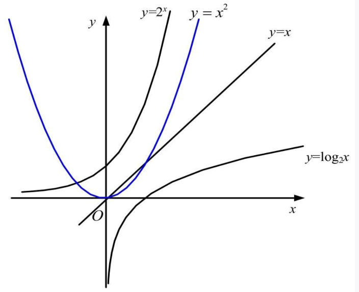

### 常见的算法复杂度

常见的算法时间复杂度如下:

1. 常数阶:常数阶算法运行的次数是一个具体的常数,如5,20,100等.常数阶算法时间复杂度通常用O(1)表示.
2. 多项式阶:很多算法时间复杂度是多项式,通常用O(n),O(n²),O(n³)等表示.
3. 指数阶:指数阶时间复杂度运行效率极差,程序员往往像躲恶魔一样避开它,常见的有O(2ⁿ),O(n!),O(nⁿ)等,对待这样的算法要极其慎重.
4. 对数阶:对数阶时间复杂度运行效率较高,常见的有O(logn),O(nlogn)等.

他们之间的运行效率从快到慢排列如下

1. O(1)	最快的
2. O(logn)
3. O(n)
4. O(nlogn)
5. O(n²)
6. O(2ⁿ)
7. O(n!)
8. O(nⁿ)
